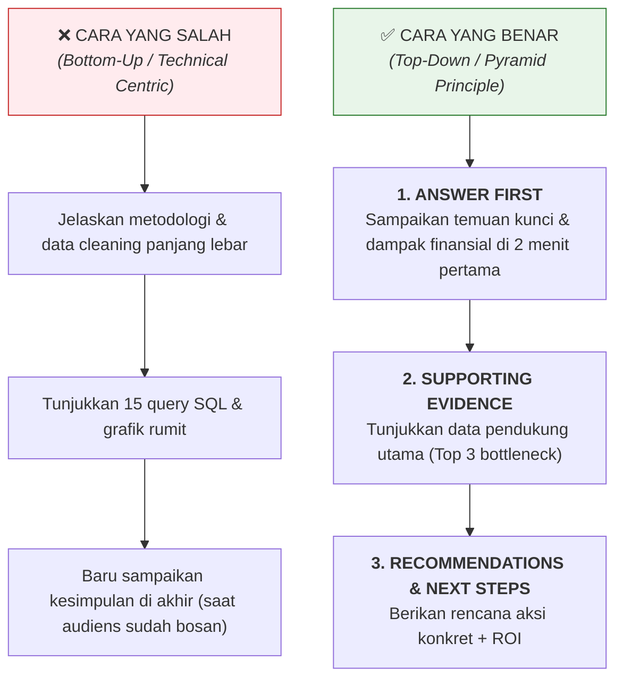
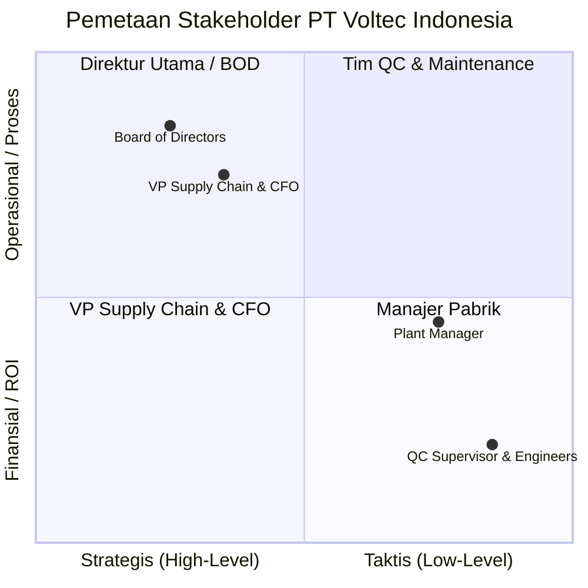
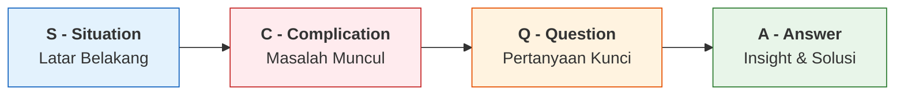
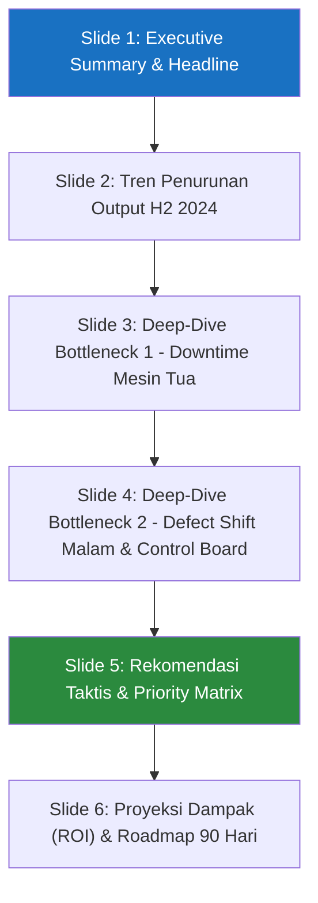
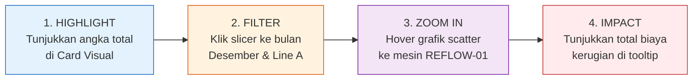
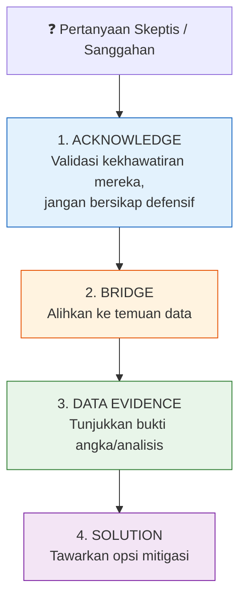

# 🎤 Panduan Presentasi ke Stakeholder: Dari Data ke Actionable Strategy

> Dokumen ini berisi panduan praktis, kerangka kerja (*presentation frameworks*), draf skrip presentasi, serta strategi menangani Q&A saat mempresentasikan hasil analisis **PT Voltec Indonesia** kepada berbagai tingkat stakeholder (C-Level, Manajer Operasional, dan Tim QC/Teknis).

---

## 📋 Daftar Isi

1. [Prinsip Utama Presentasi Data](#1-prinsip-utama-presentasi-data)
2. [Pemetaan Audiens (Audience Matrix)](#2-pemetaan-audiens-audience-matrix)
3. [Kerangka Narasi Presentasi (SCQA Framework)](#3-kerangka-narasi-presentasi-scqa-framework)
4. [Struktur Slide & Skrip Presentasi (10-Minute Executive Pitch)](#4-struktur-slide--skrip-presentasi)
5. [Teknik Visual Storytelling & Alur Dashboard](#5-teknik-visual-storytelling--alur-dashboard)
6. [Strategi Menghadapi Pertanyaan & Sanggahan (Handling Objections & Q&A)](#6-strategi-menghadapi-pertanyaan--sanggahan)
7. [Checklist Persiapan Presentasi](#7-checklist-persiapan-presentasi)

---

## 1. Prinsip Utama Presentasi Data

Banyak analisis hebat yang **gagal dieksekusi** hanya karena cara penyampaiannya yang salah. Di hadapan stakeholder, aturan utamanya adalah:

---

## 2. Pemetaan Audiens (Audience Matrix)

Setiap stakeholder memiliki fokus dan "rasa sakit" (*pain point*) yang berbeda. Jangan pernah membawakan presentasi yang sama persis untuk audiens yang berbeda!

### Tabel Penyesuaian Pesan per Stakeholder

| Stakeholder | Yang Mereka Pedulikan | Bahasa yang Digunakan | Visual yang Paling Efektif |
|---|---|---|---|
| **C-Level (CEO/CFO/VP)** | Target tahunan, kerugian finansial, ROI rekomendasi. | *"Penurunan output 8% ini berisiko mengurangi revenue Rp 1.2M per kuartal."* | Executive Summary Card, High-level Monthly Trend line chart. |
| **Plant / Production Manager** | Performa Lini (Line A-E), efisiensi shift, downtime mesin. | *"Line A drop 20% di Desember akibat bottleneck mesin SMT."* | Perbandingan output per Line, Heatmap Line-Shift. |
| **QC & Maintenance Engineers** | Defect rate per produk, root cause mesin tua, statistik part. | *"Control Board defect 6.45%, terutama pada proses soldering."* | Pareto Chart Defect, Scatter plot Downtime vs Age, Maintenance Table. |

---

## 3. Kerangka Narasi Presentasi (SCQA Framework)

Gunakan metode **SCQA** (*Situation, Complication, Question, Answer*) untuk membangun struktur alur cerita yang memikat sejak slide pertama.

### Penerapan SCQA untuk Kasus PT Voltec:

1. **Situation (Situasi):**
   > *"PT Voltec mengoperasikan 5 lini perakitan elektronik dengan target achievement rata-rata 95-98% pada awal H2 2024 (Juli)."*
2. **Complication (Komplikasi):**
   > *"Namun memasuki Q4 (Oktober-Desember), terjadi penurunan target achievement secara konsisten hingga menyentuh angka terendah **82% di bulan Desember**, diiringi dengan melonjaknya keluhan produk defect."*
3. **Question (Pertanyaan Kunci):**
   > *"Apa akar penyebab utama (*root cause*) penurunan produktivitas ini, dan di mana tepatnya titik kebocoran operasional paling kritis?"*
4. **Answer (Jawaban & Solusi):**
   > *"Hasil analisis terpadu menunjukkan 2 bottleneck utama: **Degradasi Mesin Tua (>5 tahun)** yang menyumbang 65% downtime dan **Shift Malam** dengan defect rate 5.1%. Kami menyajikan 3 langkah taktis untuk memulihkan produktivitas sebesar 8-12% dalam 3 bulan."*

---

## 4. Struktur Slide & Skrip Presentasi

Berikut adalah alur 6 Slide untuk presentasi 10 menit (*Executive Pitch deck*):

### Skrip Lengkap Presentation Walkthrough

#### 🎬 Slide 1: Executive Summary (Menit 00:00 - 01:30)
* **Visual:** Dashboard Executive KPI (Cards: Achievement 82%, Total Defect Cost, Main Bottlenecks).
* **Skrip Presentasi:**
  > *"Selamat pagi Bapak/Ibu sekalian. Hari ini saya menyampaikan laporan investigasi performa produksi H2 2024. Poin terpenting yang perlu kita soroti bersama: **Target achievement kita turun berturut-turut dari 98% di Juli menjadi 82% di Desember**. Ini bukan fluktuasi sementara, melainkan degradasi bertahap.*
  > 
  > *Kabar baiknya, kami telah mengidentifikasi dua sumber utama masalah ini: **Downtime mesin tua di Line A & C** serta **tingginya defect rate di Shift Malam**. Dengan rekomendasi yang kami susun hari ini, kita berpotensi memulihkan output 8-12% sekaligus menghemat biaya defect hingga Rp 200 juta per semester."*

---

#### 📉 Slide 2: Tren Output & Performa Lini (Menit 01:30 - 03:00)
* **Visual:** Line chart tren achievement rate per bulan & Bar chart output per Line.
* **Skrip Presentasi:**
  > *"Jika kita lihat tren bulanan di grafik ini, penurunan mulai terjadi di bulan Oktober dan semakin curam di Desember. Penurunan paling drastis terjadi pada **Line A**, yang mana output-nya drop sebesar 20% di bulan Desember saja.*
  > 
  > *Line A adalah tulang punggung produksi kita (~21% total output). Ketika Line A terganggu, 4% dari total kapasitas perusahaan ikut hilang."*

---

#### ⚙️ Slide 3: Bottleneck 1 — Mesin Tua & Korelasi Downtime (Menit 03:00 - 05:00)
* **Visual:** Scatter plot Downtime vs Output & Tabel Top 5 Mesin Downtime (REFLOW-01, WAVE-01).
* **Skrip Presentasi:**
  > *"Mengapa Line A dan C mengalami penurunan tajam? Jawabannya ada pada grafik korelasi ini. Terdapat korelasi negatif yang sangat kuat antara downtime mesin dengan hilangnya output.*
  > 
  > *Setiap 10 menit downtime tidak hanya menghentikan mesin saat itu juga, tetapi memakan waktu warm-up dan setup ulang yang memotong output sebesar 3-5%. Mesin yang berusia lebih dari 5 tahun, seperti `REFLOW-01` dan `WAVE-01`, menyumbang **65% dari total downtime pabrik**."*

---

#### 🔴 Slide 4: Bottleneck 2 — Shift Malam & Control Board Defect (Menit 05:00 - 07:00)
* **Visual:** Boxplot Defect Rate per Shift & Bar chart Defect Cost per Produk (Rupiah).
* **Skrip Presentasi:**
  > *"Masalah kedua berakar pada kualitas. **Shift Malam mencatatkan defect rate rata-rata 5.1%**, jauh lebih tinggi dibanding Shift Pagi yang hanya 3.2%. Hal ini dipicu kombinasi kelelahan operator di jam larut malam dan minimnya pengawasan QC.*
  > 
  > *Dampaknya makin fatal karena produk yang paling banyak cacat adalah **Control Board (defect rate 6.45%)**. Padahal, Control Board adalah komponen paling mahal kita dengan biaya Rp 120.000 per unit. Kebocoran di shift malam pada produk ini membakar biaya material yang sangat signifikan."*

---

#### 💡 Slide 5: Rekomendasi & Priority Matrix (Menit 07:00 - 08:30)
* **Visual:** Tabel Priority Matrix (P1, P2, P3) dengan kriteria Impact vs Effort.
* **Skrip Presentasi:**
  > *"Berdasarkan temuan tersebut, kami tidak menyarankan perbaikan sporadis, melainkan 3 aksi prioritas:*
  > 
  > 1. **P1 - Preventive Maintenance Terjadwal:** Fokus peremajaan suku cadang pada 4 mesin tua (REFLOW-01, WAVE-01, SMT-01, ICT-01) untuk menekan downtime 30%.
  > 2. **P1 - Quality Control Shift Malam:** Menambahkan 1 quality gate tambahan dan memberlakukan fatigue management (istirahat berkala) di shift malam.
  > 3. **P2 - Dedicated QC Team untuk Control Board:** Menerapkan Statistical Process Control (SPC) khusus untuk perakitan Control Board."*

---

#### 🚀 Slide 6: Proyeksi ROI & Roadmap 90 Hari (Menit 08:30 - 10:00)
* **Visual:** Timeline roadmap (Januari - Maret 2025) & Proyeksi pemulihan output.
* **Skrip Presentasi:**
  > *"Jika program P1 dijalankan mulai Januari 2025, kita menargetkan pemulihan achievement rate kembali ke kisaran **92-95% pada akhir Q1 2025** dan penghematan biaya defect sebesar Rp 200 juta.*
  > 
  > *Demikian paparan ini, saya membuka sesi diskusi dan memohon masukan dari Bapak/Ibu sekalian."*

---

## 5. Teknik Visual Storytelling & Alur Dashboard

Saat mempresentasikan Power BI Dashboard secara langsung (*live demo*), gunakan alur **Highlight -> Filter -> Zoom In -> Impact**:

---

## 6. Strategi Menghadapi Pertanyaan & Sanggahan

Stakeholder sering kali bersikap skeptis terhadap data atau rekomendasi. Gunakan teknik **Acknowledge -> Bridge -> Data -> Solution**:

### Simulasi Pertanyaan Sulit & Solusi Jawaban

#### 💬 Sanggahan 1 (Dari Plant Manager):
> *"Mesin tua kami memang sudah dari dulu begitu. Menurut saya penurunan ini murni karena pasokan komponen yang terlambat, bukan salah mesin."*

* **Jawaban Analyst (Teknik ABD):**
  * *(Acknowledge)*: *"Saya sangat memahami masukan Bapak bahwa keterlambatan material memang bisa memicu stoppage."*
  * *(Bridge)*: *"Namun, jika kita bedah data jam downtime berdasarkan kategorinya..."*
  * *(Data)*: *"Data menunjukkan bahwa 65% total downtime tercatat pada waktu perbaikan mekanis mesin REFLOW-01 dan WAVE-01, bukan pada waktu tunggu material (idle time). Selain itu, grafik scatter plot mengonfirmasi bahwa mesin baru di line yang sama tidak mengalami spike downtime serupa."*
  * *(Solution)*: *"Sebab itu, fokus kita adalah preventive maintenance suku cadang kritis agar waktu operasi mesin kembali optimal tanpa mengganti keseluruhan unit mesin."*

---

#### 💬 Sanggahan 2 (Dari CFO):
> *"Budget kita terbatas untuk Q1 2025. Mengapa kita harus alokasi dana untuk QC tambahan di Shift Malam?"*

* **Jawaban Analyst (Teknik ABD):**
  * *(Acknowledge)*: *"Tentu Bapak, efisiensi budget adalah prioritas utama kita saat ini."*
  * *(Bridge)*: *"Justru rekomendasi QC Shift Malam ini dirancang untuk menghemat pengeluaran tunai perusahaan."*
  * *(Data)*: *"Tingkat defect 5.1% di shift malam menyumbang kerugian waste material sebesar ~Rp 58 juta per bulan. Menambahkan 1 supervisor / QC inspector hanya membutuhkan cost operasional jauh di bawah nilai kerugian tersebut."*
  * *(Solution)*: *"Secara net-effect, investasi kecil ini memberikan ROI positif dan langsung menghentikan kebocoran kas di bulan pertama."*

---

#### 💬 Pertanyaan 3 (Dari Head of QC):
> *"Apakah data defect Control Board ini sudah di-clean dari kesalahan pencatatan operator?"*

* **Jawaban Analyst (Teknik ABD):**
  * *(Acknowledge)*: *"Pertanyaan yang sangat bagus. Validasi kualitas data adalah tahap pertama yang kami lakukan."*
  * *(Data)*: *"Dalam proses data cleaning di Python, kami mengeliminasi baris anomali seperti `defect_qty > output_qty` dan melakukan median imputation untuk missing records. Angka 6.45% defect rate Control Board diperoleh murni dari transaksi valid yang tersaring."*
  * *(Solution)*: *"Kami juga menyediakan notebook `data_cleaning.ipynb` jika tim QC ingin mengaudit prosedur pembersihan datanya."*

---

## 7. Checklist Persiapan Presentasi

Gunakan checklist ini 1 jam sebelum presentasi dimulai:

- [ ] **Slide Check:** Slide pertama langsung menampilkan temuan utama & dampak finansial (Answer First).
- [ ] **Dashboard Check:** File Power BI `dashboard.pbix` sudah terbuka, data ter-load sempurna, slicer berfungsi tanpa error.
- [ ] **Backup Plan:** Ekspor PDF `dashboard.pdf` dan screenshot cadangan sudah siap jika ada masalah koneksi/display.
- [ ] **Angka Kunci Terhafal:** 82% (Dec achievement), 65% (downtime mesin tua), 5.1% (defect shift malam), Rp 120.000 (cost Control Board).
- [ ] **Mental Alignment:** Bersiap mendengar sanggahan tanpa defensif; fokus membantu stakeholder mengambil keputusan terbaik.
