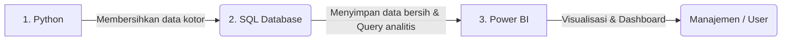

Untuk memahami posisi SQL dalam proyek ini, bayangkan Anda sedang bekerja di perusahaan manufaktur nyata. 

Data produksi harian yang berjumlah puluhan ribu hingga jutaan baris biasanya **tidak disimpan di file Excel atau CSV lokal**, melainkan disimpan di dalam **database relasional pusat (seperti PostgreSQL, MySQL, SQL Server, atau BigQuery)**.

---

### 1. Apa Peran/Posisi SQL di Sini?

Dalam portofolio ini, SQL berperan sebagai **jembatan analisis tingkat lanjut** antara data mentah dengan dashboard visual. Alur kerja seorang Data Analyst biasanya seperti ini:

1. **Python** digunakan untuk membersihkan data kotor dari lapangan (wrangling).
2. Data bersih tersebut kemudian **diunggah ke Database SQL** menggunakan skema bintang (*star schema*) yang dirancang di [schema.sql](file:///q:/Data%20Science/Production/sql/schema.sql).
3. **SQL** digunakan untuk menulis query analitis guna menjawab pertanyaan bisnis yang rumit dan berat sebelum ditarik ke Power BI. Di dunia kerja, melakukan kalkulasi berat langsung di database menggunakan SQL jauh lebih cepat daripada memprosesnya di dalam Power BI.

---

### 2. Memahami Konteks 15 Query SQL ([analysis.sql](file:///q:/Data%20Science/Production/sql/analysis.sql))

15 query ini sengaja dibuat untuk mensimulasikan permintaan analisis dari divisi yang berbeda di perusahaan. Mari kita bedah konteks bisnis dari query-query tersebut:

#### Kelompok A: Agregasi Dasar (Permintaan Laporan Rutin)
* **Query 1 (KPI Utama):** Menghitung total output, target, defect rate, dan downtime keseluruhan pabrik. (Menjawab: *"Berapa total defect rate kita selama semester ini?"*)
* **Query 2 (Performa Lini):** Membandingkan kontribusi (*share*) output antar Lini. (Menjawab: *"Lini mana yang menyumbang produk paling banyak?"*)
* **Query 3 (Analisis Shift):** Menghitung defect rate per shift dan mengkategorikannya menjadi HIGH/MEDIUM/LOW. (Menjawab: *"Apakah benar shift malam kualitasnya paling buruk?"*)

#### Kelompok B: Analisis Tren & Waktu (Menemukan Pola Penurunan)
* **Query 5 (Running Total):** Menghitung akumulasi output dari bulan ke bulan. (Menjawab: *"Bagaimana perkembangan akumulasi produksi kita menuju akhir tahun?"*)
* **Query 7 (Moving Average 7 Hari):** Menghitung rata-rata bergerak 7 hari untuk meratakan fluktuasi harian. (Menjawab: *"Kalau fluktuasi harian diabaikan, ke mana arah tren produksi kita?"*)
* **Query 10 (Month-on-Month Growth):** Membandingkan output bulan ini vs bulan lalu. (Menjawab: *"Berapa persen penurunan produksi dari November ke Desember?"*)

#### Kelompok C: Investigasi Bottleneck (Mencari Akar Masalah)
* **Query 4 (Top 5 Downtime):** Mencari 5 mesin penyumbang downtime terbesar beserta usianya. (Menjawab: *"Mesin apa yang paling sering rusak dan menghambat lini?"*)
* **Query 9 (Downtime di Atas Rata-rata):** Menggunakan subquery untuk mencari mesin yang performa downtime-nya di bawah standar rata-rata pabrik.
* **Query 15 (Dampak Downtime & Rekomendasi):** Menghubungkan usia mesin, rata-rata downtime, dan memberikan rekomendasi tindakan preventive maintenance otomatis. (Menjawab: *"Mesin mana yang harus segera masuk jadwal servis minggu depan?"*)

#### Kelompok D: Analisis Kompleks (Tingkat Lanjut)
* **Query 6 (Ranking Bulanan):** Menggunakan fungsi `RANK()` untuk melihat line mana yang menjadi "juara" produksi di setiap bulan.
* **Query 12 (Kombinasi Line-Shift):** Menggunakan CTE (*Common Table Expression*) untuk melihat performa spesifik (misal: Line A - Shift Malam) guna mendeteksi area paling kritis di pabrik.
* **Query 13 (Deteksi Anomali):** Mencari hari-hari di mana output tiba-tiba anjlok secara tidak wajar di luar batas standar deviasi (mendeteksi insiden luar biasa).

---

### Cara Anda Menjelaskannya ke Recruiter:
> *"Saya menggunakan SQL untuk mensimulasikan penyimpanan data di Data Warehouse. Skema yang saya rancang menggunakan Star Schema untuk efisiensi query. 15 query analitis yang saya buat mensimulasikan bagaimana saya menjawab pertanyaan bisnis dari berbagai departemen—mulai dari melacak performa lini produksi, menghitung pertumbuhan Month-on-Month menggunakan Window Functions, hingga membuat prioritas jadwal perawatan mesin menggunakan logika query analitis."*