# 🧠 Proses Berpikir Seorang Data Analyst: Dari Masalah Bisnis ke Insight & Rekomendasi

> Dokumen ini menjelaskan **bagaimana seorang Data Analyst berpikir secara sistematis** — dari pertama kali menerima masalah bisnis hingga menghasilkan insight yang bisa ditindaklanjuti (*actionable insights*). Semua contoh mengacu pada proyek **PT Voltec Indonesia**.

---

## 📋 Daftar Isi

1. [Gambaran Besar: Alur Berpikir End-to-End](#1-gambaran-besar-alur-berpikir-end-to-end)
2. [Fase 1: Memahami Masalah Bisnis (Business Understanding)](#2-fase-1-memahami-masalah-bisnis)
3. [Fase 2: Menerjemahkan ke Pertanyaan Data (Question Framing)](#3-fase-2-menerjemahkan-ke-pertanyaan-data)
4. [Fase 3: Mengumpulkan & Membersihkan Data (Data Wrangling)](#4-fase-3-mengumpulkan--membersihkan-data)
5. [Fase 4: Eksplorasi & Analisis (EDA + SQL Analysis)](#5-fase-4-eksplorasi--analisis)
6. [Fase 5: Menyintesis Temuan Menjadi Insight](#6-fase-5-menyintesis-temuan-menjadi-insight)
7. [Fase 6: Merumuskan Rekomendasi Bisnis](#7-fase-6-merumuskan-rekomendasi-bisnis)
8. [Fase 7: Menyajikan Hasil (Storytelling & Dashboard)](#8-fase-7-menyajikan-hasil)
9. [Pola Pikir Kritis: Yang Membedakan Analyst Biasa dan Analyst Hebat](#9-pola-pikir-kritis)
10. [Checklist Proses Berpikir](#10-checklist)

---

## 1. Gambaran Besar: Alur Berpikir End-to-End

Berikut adalah keseluruhan proses berpikir seorang Data Analyst yang terjadi secara **iteratif** (bukan linear):

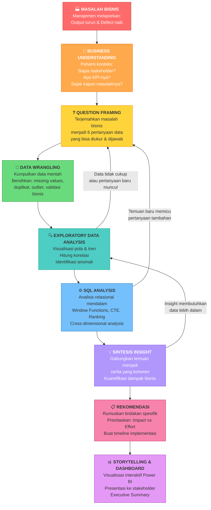

> **Poin Penting:** Perhatikan panah yang kembali ke atas. Proses ini **bukan linear satu arah**. Seorang analyst yang baik akan sering kembali ke fase sebelumnya ketika menemukan data baru atau pertanyaan baru muncul dari hasil analisis.

---

## 2. Fase 1: Memahami Masalah Bisnis

### Apa yang terjadi di kepala seorang Analyst?

Ketika manajemen PT Voltec berkata *"Output produksi turun dan defect meningkat"*, seorang analyst **tidak langsung membuka data**. Yang pertama dilakukan adalah **bertanya**:

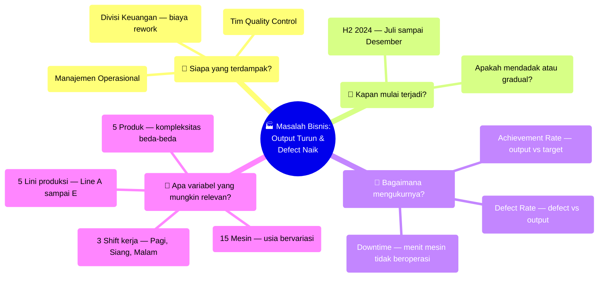

### Proses berpikir konkretnya:

| Pertanyaan Internal Analyst | Jawaban yang Dicari | Sumber Informasi |
|---|---|---|
| "Seberapa parah masalahnya?" | Target achievement turun berapa persen? | Data produksi historis |
| "Apakah semua lini terdampak atau hanya beberapa?" | Perbanding performa antar lini | Data per line |
| "Apakah ada pola waktu?" | Tren bulanan, mingguan, per shift | Data dengan timestamp |
| "Apa faktor yang bisa dikontrol?" | Mesin (maintenance), Shift (rotasi), QC (prosedur) | Domain knowledge manufaktur |

> **Kunci Fase 1:** Jangan langsung koding. Pahami dulu **konteks bisnis** dan **siapa yang akan menggunakan hasil analisis Anda**. Manajemen tidak peduli dengan koefisien korelasi — mereka peduli dengan *"berapa uang yang hilang dan apa yang harus dilakukan?"*

---

## 3. Fase 2: Menerjemahkan ke Pertanyaan Data

### Dari masalah abstrak ke pertanyaan terukur

Ini adalah **keterampilan paling penting** seorang Data Analyst: mengubah keluhan bisnis yang *vague* menjadi pertanyaan yang bisa dijawab dengan data.

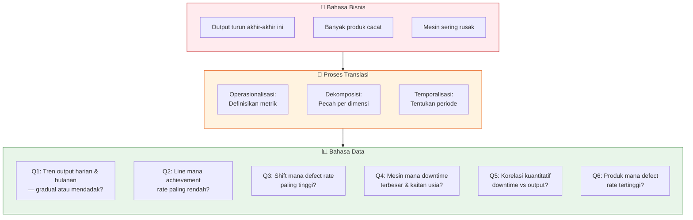

### Tiga teknik translasi yang digunakan:

**1. Operasionalisasi** — Mengubah kata-kata abstrak menjadi metrik terukur:
- *"Output turun"* → Achievement Rate = `SUM(output_qty) / SUM(target_qty) × 100%`
- *"Banyak cacat"* → Defect Rate = `SUM(defect_qty) / SUM(output_qty) × 100%`
- *"Mesin rusak"* → Total Downtime = `SUM(downtime_minutes)`

**2. Dekomposisi** — Memecah masalah besar menjadi dimensi-dimensi:
- Per **waktu** (bulan, hari, shift)
- Per **lini produksi** (Line A-E)
- Per **mesin** (15 mesin, usia berbeda)
- Per **produk** (5 produk, kompleksitas berbeda)

**3. Temporalisasi** — Menentukan periode dan granularity:
- Periode: H2 2024 (Juli-Desember = 184 hari)
- Granularity: harian untuk tren, bulanan untuk executive report

---

## 4. Fase 3: Mengumpulkan & Membersihkan Data

### Proses berpikir saat Data Wrangling

Seorang analyst tidak membersihkan data secara acak. Ada **logika keputusan** di setiap langkah:

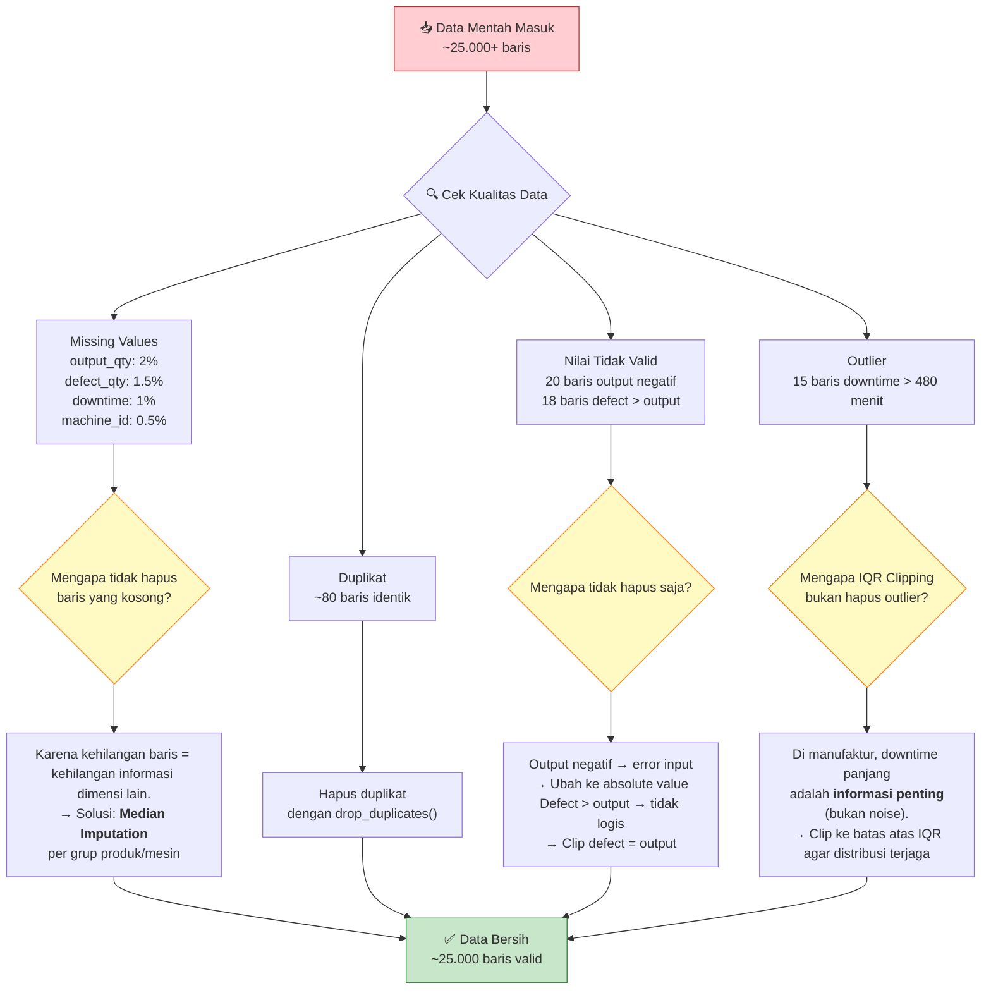

### Poin kritis yang perlu dipahami:

> **Mengapa Median, bukan Mean?**
> Karena data produksi yang tercampur outlier membuat nilai rata-rata (mean) menjadi terdistorsi. Median lebih *robust* — tidak terpengaruh oleh nilai ekstrim. Contoh: jika 10 batch punya downtime [5, 8, 10, 12, 15, 300], mean = 58.3 (tidak representatif), sedangkan median = 11 (lebih akurat).

> **Mengapa IQR Clipping, bukan Remove?**
> Menghapus outlier berarti menghapus seluruh baris data — termasuk informasi tentang line, shift, produk, dan tanggal di baris tersebut. Clipping mempertahankan baris tapi membatasi nilai ekstrimnya.

---

## 5. Fase 4: Eksplorasi & Analisis

### Dua jalur analisis yang saling melengkapi

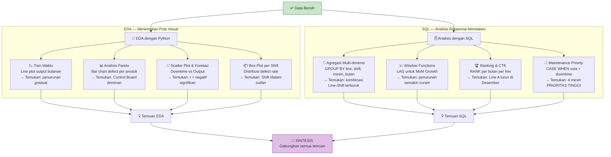

### Cara berpikir saat EDA — bukan asal buat grafik!

Setiap visualisasi dibuat untuk **menjawab pertanyaan spesifik**:

| Visualisasi | Pertanyaan yang Dijawab | Apa yang Dicari | Apa yang Ditemukan |
|---|---|---|---|
| Line Plot output bulanan | Q1: Tren output gradual atau mendadak? | Apakah garis menurun secara konsisten? | Ya — turun dari 98% ke 82% secara gradual |
| Box Plot defect per shift | Q3: Shift mana defect tertinggi? | Shift mana yang median-nya paling tinggi? | Shift Malam: ~5.1% vs Pagi: ~3.2% |
| Scatter plot downtime vs output | Q5: Ada korelasi? | Apakah titik-titik membentuk pola diagonal? | Ya — korelasi negatif |
| Bar chart defect per produk | Q6: Produk mana defect tertinggi? | Bar mana yang paling tinggi? | Control Board: 6.45% |

### Mengapa SQL dibutuhkan selain Python?

Python/Pandas kuat untuk visualisasi dan statistik dasar. Tapi SQL unggul untuk:
- **Cross-dimensional analysis**: Menggabungkan data dari beberapa tabel (JOIN line + shift + mesin + produk secara bersamaan)
- **Window Functions**: Menghitung running total, moving average, dan month-on-month growth yang kompleks
- **Reproducibility**: Query SQL bisa langsung dijadikan view untuk Power BI dashboard

---

## 6. Fase 5: Menyintesis Temuan Menjadi Insight

### Insight ≠ Fakta — Inilah yang membedakan analyst dari data entry!

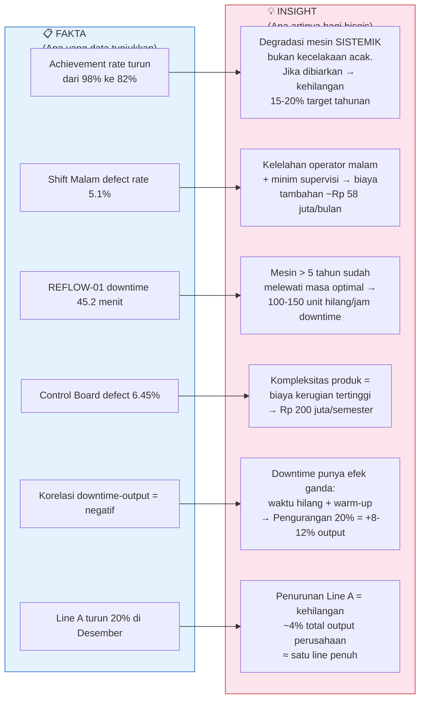

### Tiga komponen sebuah insight yang baik:

Setiap insight dalam `insights_and_recommendations.md` memiliki tiga bagian — dan ini bukan kebetulan:

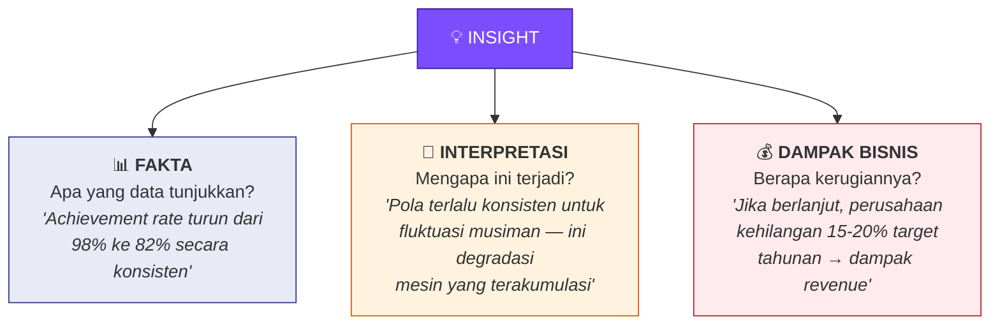

> **Mengapa ini penting?**
> - **Fakta saja** = laporan otomatis (bisa dihasilkan oleh script)
> - **Fakta + Interpretasi** = analisis (membutuhkan domain knowledge)
> - **Fakta + Interpretasi + Dampak Bisnis** = INSIGHT (membutuhkan business acumen)
>
> Seorang recruiter mencari orang yang bisa sampai di level ketiga.

---

## 7. Fase 6: Merumuskan Rekomendasi Bisnis

### Dari Insight ke Action Plan

Rekomendasi yang baik harus **spesifik, terukur, dan diprioritaskan**:

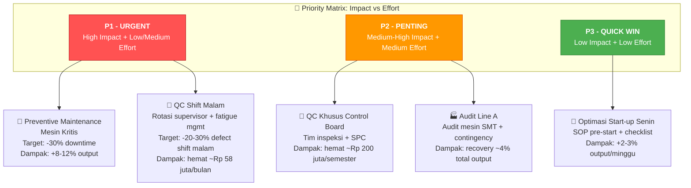

### Mengapa kita memprioritaskan?

Perusahaan tidak punya sumber daya tak terbatas. Seorang analyst yang baik tidak hanya berkata *"perbaiki semuanya"*, tapi memberikan **urutan tindakan** berdasarkan pertimbangan:

| Kriteria | Pertanyaan | Contoh di Proyek Ini |
|---|---|---|
| **Impact** | Seberapa besar dampak jika dilakukan? | Preventive Maintenance = +8-12% output (TINGGI) |
| **Effort** | Seberapa sulit/mahal implementasinya? | QC Shift Malam = tambah supervisor (RENDAH) |
| **Urgency** | Seberapa cepat harus ditindaklanjuti? | Mesin tua semakin degradasi setiap bulan (URGENT) |
| **Feasibility** | Apakah realistis dilakukan? | SPC untuk Control Board = butuh training (SEDANG) |

---

## 8. Fase 7: Menyajikan Hasil

### Dua audiens, dua cara penyajian

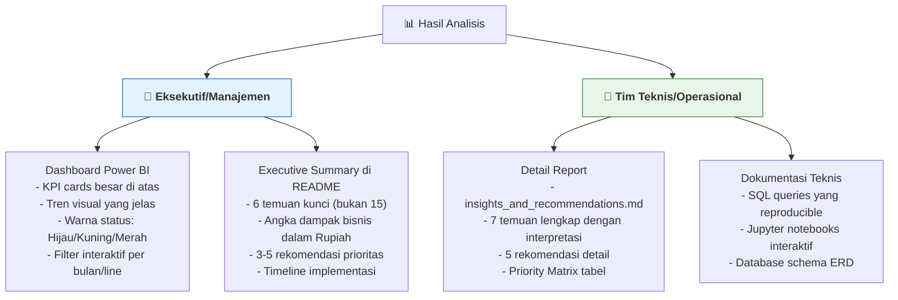

### Struktur Dashboard Power BI — Ada logika di baliknya:

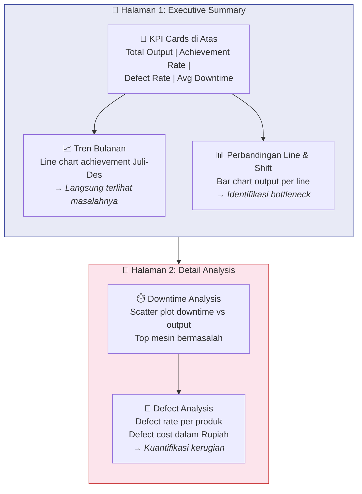

> **Prinsip Dashboard:** Informasi disusun dari **umum ke spesifik** (*drill-down*). Halaman 1 menjawab *"Ada masalah apa?"*, Halaman 2 menjawab *"Di mana tepatnya dan seberapa parah?"*.

---

## 9. Pola Pikir Kritis: Yang Membedakan Analyst Biasa dan Analyst Hebat

### Diagram Perbandingan

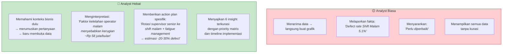

### Lima kebiasaan berpikir kritis seorang analyst:

1. **"So What?" Test** — Setelah menemukan fakta, selalu tanyakan *"lalu kenapa ini penting?"* Jika tidak bisa menjawab, fakta itu belum jadi insight.

2. **Triangulasi** — Jangan percaya satu sumber saja. Insight tentang "mesin tua bermasalah" dikonfirmasi oleh tiga sumber: EDA (scatter plot), SQL (Query 4 & 15), dan domain knowledge (mesin > 5 tahun melewati masa optimal).

3. **Kuantifikasi Dampak** — *"Defect tinggi"* tidak bermakna bagi manajemen. *"Defect Control Board menyebabkan kerugian Rp 200 juta/semester"* bermakna.

4. **Berpikir Kontra-faktual** — *"Jika kita TIDAK melakukan maintenance, apa yang terjadi?"* → Tren penurunan output 8% per bulan akan berlanjut → kehilangan 15-20% target tahunan.

5. **Iterasi** — Temuan dari SQL Analysis (misalnya: Line A turun di Desember) bisa memicu pertanyaan baru yang kembali ke EDA (mengapa hanya Line A? apa yang berubah di Desember?).

---

## 10. Checklist Proses Berpikir

Gunakan checklist ini untuk memastikan proses analisis Anda lengkap:

### Fase Pemahaman
- [ ] Saya bisa menjelaskan masalah bisnis dalam 2 kalimat tanpa jargon teknis
- [ ] Saya tahu siapa stakeholder dan apa yang mereka butuhkan
- [ ] Saya sudah mendefinisikan KPI utama (Achievement Rate, Defect Rate, Downtime)

### Fase Pertanyaan
- [ ] Setiap pertanyaan bisa dijawab dengan data yang tersedia
- [ ] Pertanyaan mencakup semua dimensi relevan (waktu, lini, mesin, shift, produk)
- [ ] Tidak ada pertanyaan yang terlalu vague (*"kenapa semuanya jelek?"*)

### Fase Data Wrangling
- [ ] Saya bisa menjelaskan **mengapa** saya memilih metode cleaning tertentu (bukan hanya **bagaimana**)
- [ ] Tidak ada data yang hilang tanpa alasan yang jelas
- [ ] Business rules tervalidasi (defect ≤ output, downtime ≤ 480 menit)

### Fase Analisis
- [ ] Setiap visualisasi menjawab pertanyaan spesifik
- [ ] Temuan dikonfirmasi dari minimal 2 sumber/metode (triangulasi)
- [ ] Saya sudah mencari pola yang *tidak terduga* (seperti Monday Effect)

### Fase Insight & Rekomendasi
- [ ] Setiap insight memiliki: Fakta + Interpretasi + Dampak Bisnis
- [ ] Rekomendasi spesifik (bukan *"perlu diperbaiki"* tapi *"rotasi supervisor + fatigue management"*)
- [ ] Ada prioritas yang jelas (P1/P2/P3) dengan estimasi dampak
- [ ] Ada timeline implementasi yang realistis

### Fase Presentasi
- [ ] Dashboard memiliki alur dari umum ke spesifik (drill-down)
- [ ] Executive summary ringkas (6 temuan, bukan 15)
- [ ] Angka-angka penting dalam konteks bisnis (Rupiah, persentase kehilangan)

---

> **Pesan Penutup:** Portofolio ini bukan tentang seberapa canggih kode Python atau SQL Anda — tapi tentang seberapa jelas Anda bisa menjelaskan **proses berpikir** dari masalah bisnis ke solusi yang terukur. Seorang recruiter akan lebih terkesan dengan analyst yang bisa bercerita *"Saya menemukan bahwa kelelahan operator malam menyebabkan kerugian Rp 58 juta/bulan, dan saya merekomendasikan rotasi supervisor yang bisa menekan angka itu 20-30%"* dibanding yang hanya menunjukkan grafik tanpa konteks.
