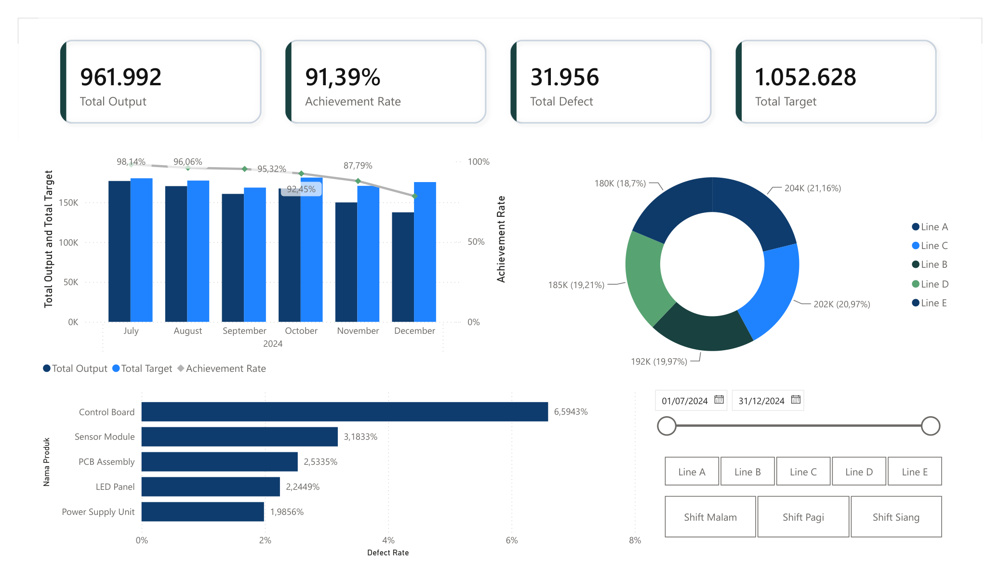
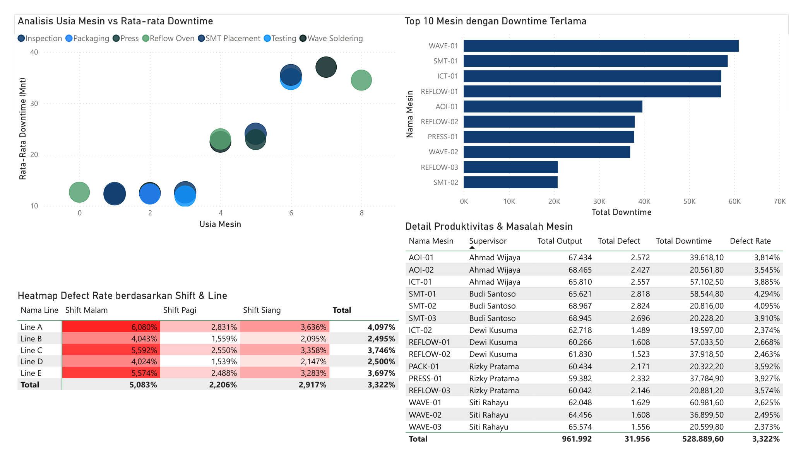

# Portofolio Data Analyst: Analisis Produksi & Kualitas Barang Elektronik (PT Voltec Indonesia)

Proyek ini menyajikan analisis data end-to-end terkait penurunan output produksi dan peningkatan tingkat defect pada **PT Voltec Indonesia**, sebuah perusahaan manufaktur elektronik fiktif, selama semester kedua (H2) tahun 2024. 

Portofolio ini dirancang untuk mendemonstrasikan kemampuan analitis data secara komprehensif mulai dari **pemahaman bisnis, pembersihan data (Python), analisis eksplorasi (EDA), pemodelan database & analisis tingkat lanjut (SQL), hingga visualisasi interaktif (Power BI)**.

---

## 📌 Latar Belakang & Masalah Bisnis

PT Voltec Indonesia mengoperasikan 5 lini perakitan elektronik (`Line A` sampai `Line E`) dengan 15 mesin manufaktur yang memproduksi 5 jenis produk utama (seperti *PCB Assembly*, *Sensor Module*, dan *Control Board*). 

Dalam beberapa bulan terakhir H2 2024, manajemen mendapati adanya tren penurunan pencapaian target produksi (*Achievement Rate*) secara keseluruhan, disertai dengan laporan peningkatan jumlah produk cacat (*Defect*). Tim Data Analyst diminta untuk melakukan investigasi mendalam guna menjawab pertanyaan-pertanyaan strategis berikut:
1. **Bagaimana tren output produksi harian dan bulanan?** Apakah penurunan terjadi secara mendadak atau gradual?
2. **Lini perakitan mana yang memiliki performa paling rendah** dalam hal output dan efisiensi?
3. **Shift kerja mana yang paling banyak menyumbang produk defect**, dan apa faktor pemicunya?
4. **Mesin mana yang menjadi kontributor downtime terbesar** dan bagaimana kaitannya dengan usia mesin?
5. **Bagaimana korelasi langsung antara waktu downtime mesin dengan hilangnya output produksi?**
6. **Produk apa yang memiliki tingkat cacat (defect rate) tertinggi** yang membutuhkan perhatian khusus QC?

---

## 📂 Struktur Repositori

```text
├── data/
│   ├── raw/                      # Data mentah (.csv) hasil injeksi masalah kualitas data
│   └── cleaned/                  # Data bersih (.csv) siap pakai hasil wrangling
├── python/
│   ├── generate_data.py          # Skrip Python untuk simulasi data & pola defect manufaktur
│   ├── data_cleaning.ipynb       # Notebook pembersihan data, missing values, & IQR outlier handling
│   └── eda.ipynb                 # Notebook analisis visual & korelasi EDA (Pandas, Seaborn)
├── sql/
│   ├── schema.sql                # DDL skema star-schema database produksi
│   ├── load_data.sql             # Panduan import csv & DML insert data dimensi
│   ├── views.sql                 # DDL views analisis terintegrasi untuk Power BI
│   ├── analysis.sql              # 15 query analisis SQL tingkat lanjut (CTE, Window Functions, Rank)
│   ├── sql_analysis.ipynb        # Uji coba interaktif 15 query & 4 views via SQLite3 & Pandas
│   └── README.md                 # Dokumentasi detail skema, kamus data & showcase SQL

├── powerbi/
│   ├── dashboard.pbix            # File mentah Power BI Dashboard
│   └── dashboard.pdf             # Ekspor PDF dari Dashboard
├── insights_and_recommendations.md # Laporan temuan kunci & rekomendasi tindakan bisnis
└── README.md                     # Dokumentasi utama proyek

```

---

## 🛠️ Metodologi & Langkah Pengerjaan

### 1. Data Wrangling & Cleaning (Python/Pandas)
Data mentah memiliki berbagai masalah kualitas data (missing values, duplikat, outlier ekstrim, record bernilai negatif, dan ketidakkonsistenan relasi bisnis) yang kemudian dibersihkan di notebook [data_cleaning.ipynb](python/data_cleaning.ipynb):
* **Missing values** di-imputasi menggunakan nilai median berdasarkan grup spesifik (misal: defect rate diisi berdasarkan median produk sejenis).
* **Outlier** ditangani dengan metode *IQR Clipping* agar tidak merusak distribusi data asli.
* **Business rules validation**: Menjamin aturan bisnis terpenuhi (misal: memastikan `defect_qty` tidak pernah melebihi `output_qty`).

### 2. Exploratory Data Analysis (EDA)
Di notebook [eda.ipynb](python/eda.ipynb), dilakukan analisis korelasi dan visualisasi untuk menemukan pola tersembunyi:
* **Tren Waktu**: Menganalisis penurunan output bulanan dari Juli hingga Desember 2024.
* **Analisis Pareto**: Mengidentifikasi produk penyumbang defect terbesar.
* **Scatter Plot**: Menghitung korelasi negatif antara downtime mesin dan jumlah output yang dihasilkan.

### 3. Analisis Relasional (SQL)
Menggunakan database relasional dengan rancangan **Star Schema** (terdiri dari 1 tabel fakta `production_fact` dan 4 tabel dimensi `line_dim`, `machine_dim`, `product_dim`, dan `shift_dim`). Dokumentasi lengkap skema, kamus data, dan showcase query analitis dapat dilihat pada **[Dokumentasi SQL Portfolio](sql/README.md)**.

Seluruh DDL skema, views, dan 15 query analisis dapat dieksekusi secara interaktif melalui notebook **[sql_analysis.ipynb](sql/sql_analysis.ipynb)** menggunakan SQLite3 lokal. Teknik analisis relasional yang diuji meliputi:
* **Window Functions (`SUM OVER`, `AVG OVER`)** untuk menghitung akumulasi total bulanan (*running total*) dan rata-rata bergerak 7 hari (*moving average*).
* **Common Table Expressions (CTE)** untuk mengisolasi logika agregasi performa perpaduan Lini-Shift.
* **LAG/LEAD** untuk menghitung analisis perubahan performa dari bulan ke bulan (*Month-on-Month growth*).
* **Database Views** (`views.sql`) untuk merangkum query analitis operasional, pemeliharaan mesin, dan defect cost finansial.


---

## 📈 Ringkasan Temuan & Insight Kunci

Berdasarkan analisis data terpadu, ditemukan beberapa fakta operasional kritis berikut:
1. **Penurunan Output Gradual**: Target achievement drop secara konsisten dari **98% di bulan Juli** menjadi **82% di bulan Desember**. Ini mengindikasikan adanya degradasi mesin yang berlangsung lama.
2. **Defect Rate Tinggi pada Shift Malam**: Shift Malam memberikan kontribusi defect rate tertinggi (~5.1%), jauh di atas Shift Pagi (~3.2%). Diduga dipengaruhi oleh faktor kelelahan operator dan minimnya pengawasan.
3. **Bottleneck pada Mesin Tua**: Mesin dengan usia pakai di atas 5 tahun (seperti `REFLOW-01` dan `WAVE-01`) menyumbang **65% dari total downtime pabrik**.
4. **Control Board Masalah Utama QC**: Produk *Control Board* memiliki defect rate tertinggi sebesar **6.45%** (rata-rata produk lain hanya ~3%), yang berdampak signifikan pada kerugian finansial karena biaya per unitnya paling mahal (Rp 120.000).

*Detail analisis mendalam dan rekomendasi taktis dapat dibaca pada dokumen:* **[Insights & Recommendations](insights_and_recommendations.md)**.

---

## 💡 Rekomendasi Tindakan Bisnis
1. **P1 - Preventive Maintenance Terjadwal**: Fokus utama pada peremajaan suku cadang mesin tua (>5 tahun) untuk menekan downtime hingga 30%.
2. **P1 - Optimalisasi Shift Malam**: Menambahkan rotasi supervisor senior ke shift malam serta menerapkan *fatigue management* (jeda istirahat berkala).
3. **P2 - Pengetatan QC Control Board**: Memasang tim inspeksi khusus dan menerapkan metode *Statistical Process Control* (SPC) pada jalur perakitan Control Board.

---

## 🖥️ Visualisasi Dashboard Power BI

Berikut adalah tampilan interaktif dari dashboard Power BI:

### Halaman 1: Ringkasan Performa Produksi (Executive Summary)


### Halaman 2: Analisis Detail Downtime & Kualitas Produk (Defect)


> [!NOTE]
> File mentah Power BI (`.pbix`) dapat diakses di folder [powerbi/dashboard.pbix](powerbi/dashboard.pbix), dan file laporan lengkap format PDF dapat diunduh di [powerbi/dashboard.pdf](powerbi/dashboard.pdf).

