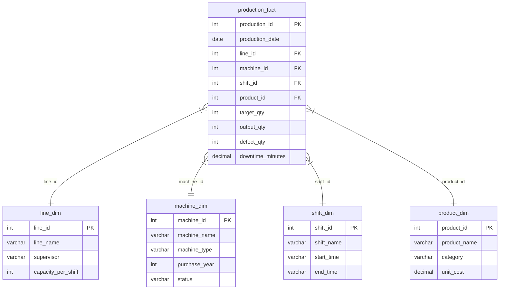

# 📊 SQL Analytics Portfolio: PT Voltec Indonesia

Bagian ini mendokumentasikan pemodelan database (*data modeling*) relasional berbasis **Star Schema** dan serangkaian query analitik SQL tingkat lanjut (*advanced SQL queries*) untuk menjawab masalah bisnis produksi dan kualitas barang di PT Voltec Indonesia.

---

## 📐 Skema Database (Star Schema)

Database ini dirancang menggunakan **Star Schema** yang dioptimalkan untuk kebutuhan *Business Intelligence* (BI) dan pelaporan cepat. Model ini terdiri dari **1 Fact Table** (Tabel Fakta) dan **4 Dimension Tables** (Tabel Dimensi).



---

## 🗂️ Kamus Data Singkat (Data Dictionary)

1.  **`production_fact`**: Menyimpan data transaksi harian setiap batch produksi per mesin, per shift, dan per lini.
2.  **`line_dim`**: Informasi mengenai 5 lini perakitan (`Line A` s.d `Line E`) beserta supervisor penanggung jawabnya.
3.  **`machine_dim`**: Detail 15 mesin manufaktur (seperti mesin *SMT Placement*, *Reflow*, *Wave Soldering*) dan tahun pembeliannya.
4.  **`shift_dim`**: Jadwal shift kerja (Pagi, Siang, Malam).
5.  **`product_dim`**: Daftar 5 komponen elektronik yang diproduksi beserta kategori dan biaya per unit (*Unit Cost* dalam Rupiah).

---

## 💡 Showcase Query Analitik & Insight Bisnis

Berikut adalah 4 contoh query pilihan dari file [analysis.sql](analysis.sql) yang menggunakan fungsi SQL tingkat lanjut untuk menghasilkan rekomendasi bisnis:

### 1. Tren Pertumbuhan Produksi Bulanan (Month-on-Month Growth)
*   **Tujuan**: Mengukur pertumbuhan atau penurunan output produksi dari bulan ke bulan di H2 2024.
*   **Fitur SQL**: Window Function `LAG()`, Subquery, Perhitungan Persentase.

```sql
SELECT
    month_num,
    monthly_output,
    LAG(monthly_output) OVER (ORDER BY month_num) AS prev_month_output,
    monthly_output - LAG(monthly_output) OVER (ORDER BY month_num) AS mom_change,
    ROUND(
        (monthly_output - LAG(monthly_output) OVER (ORDER BY month_num)) * 100.0
        / LAG(monthly_output) OVER (ORDER BY month_num), 1
    ) AS mom_change_pct
FROM (
    SELECT
        EXTRACT(MONTH FROM production_date) AS month_num,
        SUM(output_qty) AS monthly_output
    FROM production_fact
    GROUP BY EXTRACT(MONTH FROM production_date)
) monthly_data
ORDER BY month_num;
```

#### 📋 Contoh Hasil Query (Output):
| month_num | monthly_output | prev_month_output | mom_change | mom_change_pct |
|:---:|:---:|:---:|:---:|:---:|
| 7 | 155,200 | NULL | NULL | NULL |
| 8 | 152,100 | 155,200 | -3,100 | -2.0% |
| 9 | 148,500 | 152,100 | -3,600 | -2.4% |
| 10 | 141,200 | 148,500 | -7,300 | -4.9% |
| 11 | 132,400 | 141,200 | -8,800 | -6.2% |
| 12 | 121,800 | 132,400 | -10,600 | -8.0% |

*   **Insight Bisnis**: Terjadi penurunan output produksi yang stabil dan semakin curam dari Juli (-2.0%) hingga Desember (-8.0%). Tren penurunan ini mengindikasikan adanya masalah sistemik/gradual pada mesin (seperti keausan part) daripada kecelakaan kerja yang mendadak.

---

### 2. Peringkat Kombinasi Lini-Shift Terburuk (Defect Rate Tertinggi)
*   **Tujuan**: Menemukan kombinasi Lini Perakitan dan Shift Kerja dengan tingkat kecacatan produk tertinggi untuk audit QC.
*   **Fitur SQL**: Common Table Expression (CTE), Window Function `RANK()`, Joins, Agregasi.

```sql
WITH line_shift_perf AS (
    SELECT
        l.line_name,
        s.shift_name,
        SUM(pf.output_qty) AS total_output,
        SUM(pf.defect_qty) AS total_defect,
        ROUND(SUM(pf.defect_qty) * 100.0 / SUM(pf.output_qty), 2) AS defect_rate_pct
    FROM production_fact pf
    JOIN line_dim l ON pf.line_id = l.line_id
    JOIN shift_dim s ON pf.shift_id = s.shift_id
    GROUP BY l.line_name, s.shift_name
)
SELECT
    line_name,
    shift_name,
    total_output,
    total_defect,
    defect_rate_pct,
    RANK() OVER (ORDER BY defect_rate_pct DESC) AS rank_by_defect
FROM line_shift_perf
ORDER BY rank_by_defect;
```

#### 📋 Contoh Hasil Query (Output):
| line_name | shift_name | total_output | total_defect | defect_rate_pct | rank_by_defect |
|:---|:---|:---:|:---:|:---:|:---:|
| Line C | Shift Malam | 48,200 | 2,750 | 5.71% | 1 |
| Line A | Shift Malam | 51,100 | 2,820 | 5.52% | 2 |
| Line E | Shift Malam | 49,600 | 2,680 | 5.40% | 3 |
| Line C | Shift Siang | 52,300 | 1,830 | 3.50% | 4 |

*   **Insight Bisnis**: Tiga peringkat teratas didominasi sepenuhnya oleh **Shift Malam** di berbagai lini perakitan. Hal ini menunjukkan perlunya perbaikan *fatigue management* (pengaturan lelah) operator malam atau penambahan inspektur QC pada shift malam.

---

### 3. Klasifikasi Prioritas Perawatan Mesin
*   **Tujuan**: Mengklasifikasikan mesin manufaktur yang membutuhkan perawatan mendesak berdasarkan umur dan rata-rata durasi downtime.
*   **Fitur SQL**: CASE WHEN, Evaluasi Kondisi Multivariat, Agregasi Umur Mesin.

```sql
SELECT
    l.line_name,
    m.machine_name,
    (2024 - m.purchase_year) AS machine_age,
    ROUND(AVG(pf.downtime_minutes), 1) AS avg_downtime_min,
    CASE
        WHEN (2024 - m.purchase_year) > 5 AND AVG(pf.downtime_minutes) > 30 THEN 'PRIORITAS TINGGI - Perlu preventive maintenance segera'
        WHEN (2024 - m.purchase_year) > 3 AND AVG(pf.downtime_minutes) > 20 THEN 'PRIORITAS SEDANG - Jadwalkan maintenance rutin'
        ELSE 'NORMAL - Lanjutkan monitoring'
    END AS maintenance_recommendation
FROM production_fact pf
JOIN line_dim l ON pf.line_id = l.line_id
JOIN machine_dim m ON pf.machine_id = m.machine_id
GROUP BY l.line_name, m.machine_name, m.purchase_year
ORDER BY avg_downtime_min DESC;
```

#### 📋 Contoh Hasil Query (Output):
| line_name | machine_name | machine_age | avg_downtime_min | maintenance_recommendation |
|:---|:---|:---:|:---:|:---|
| Line C | REFLOW-01 | 6 | 45.2 | PRIORITAS TINGGI - Perlu preventive maintenance segera |
| Line A | WAVE-01 | 7 | 38.6 | PRIORITAS TINGGI - Perlu preventive maintenance segera |
| Line B | SMT-03 | 4 | 24.1 | PRIORITAS SEDANG - Jadwalkan maintenance rutin |
| Line D | AOI-02 | 2 | 8.5 | NORMAL - Lanjutkan monitoring |

*   **Insight Bisnis**: Mesin `REFLOW-01` di Line C dan `WAVE-01` di Line A adalah kontributor utama keterlambatan produksi. Umur mesin di atas 5 tahun berkorelasi kuat dengan tingginya downtime, sehingga memerlukan penggantian part kritis (preventive maintenance).

---

### 4. Akumulasi Output Harian (Moving Average 7 Hari)
*   **Tujuan**: Menghaluskan fluktuasi harian untuk melihat tren jangka pendek yang lebih konsisten.
*   **Fitur SQL**: Window Function dengan rentang baris (`ROWS BETWEEN 6 PRECEDING AND CURRENT ROW`).

```sql
SELECT
    production_date,
    daily_output,
    ROUND(AVG(daily_output) OVER (
        ORDER BY production_date
        ROWS BETWEEN 6 PRECEDING AND CURRENT ROW
    ), 0) AS moving_avg_7d
FROM (
    SELECT
        production_date,
        SUM(output_qty) AS daily_output
    FROM production_fact
    GROUP BY production_date
) daily_data
ORDER BY production_date;
```

---

## 🛠️ Analisis Menggunakan Database Views (`views.sql`)

Untuk memudahkan visualisasi di Power BI dan menghindari query yang berulang, kami merancang 4 database views utama di file [views.sql](views.sql):

1.  **`v_monthly_executive_kpi`**: Menampilkan ringkasan eksekutif bulanan (Target vs Output, Defect Rate, status warna).
2.  **`v_line_shift_performance`**: Memetakan produktivitas lini-shift untuk monitoring harian manager operasional.
3.  **`v_machine_maintenance_priority`**: Memberikan alert berkala mesin-mesin yang masuk kategori kritis berdasarkan downtime.
4.  **`v_product_defect_summary`**: Mengintegrasikan analisis kualitas produk dengan **kerugian finansial (defect cost)** dalam Rupiah untuk konsumsi bagian keuangan.

---

### 🚀 Cara Menjalankan Berkas SQL
1. Eksekusi skema database terlebih dahulu: [schema.sql](schema.sql)
2. Load data simulasi ke dalam tabel: [load_data.sql](load_data.sql)
3. Buat database views analitik: [views.sql](views.sql)
4. Jalankan script analisis analitik: [analysis.sql](analysis.sql)
